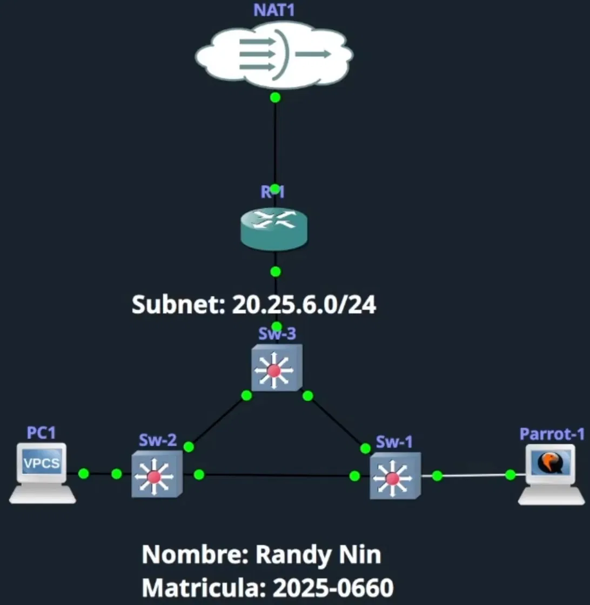

# DHCP-SPOOFING

> **Autor:** Randy Nin **Laboratorio de Seguridad de Redes | GNS3**

Script de Python que implementa un servidor DHCP malicioso diseñado para ganar la condición de carrera contra el servidor legítimo mediante el flood de múltiples Offers por cada Discover recibido. Al ganar la carrera, inyecta una configuración de red controlada por el atacante en la víctima, apuntando el default gateway hacia el sistema atacante y logrando una posición Man-in-the-Middle sin requerir envenenamiento ARP.

---

## Contenido del repositorio

```
DHCP-SPOOFING/
├── dhcp_spoofing.py
├── Documentación Tecnica Profesional DHCP SPOOFING (Randy Nin -- 2025-0660).pdf
└── README.md
```

---

## Documentación técnica

La documentación técnica completa de este laboratorio está disponible en:

**[Documentación Tecnica Profesional DHCP SPOOFING (Randy Nin -- 2025-0660).pdf](Documentación%20Tecnica%20Profesional%20DHCP%20SPOOFING%20(Randy%20Nin%20--%202025-0660).pdf)**

Incluye contexto técnico del protocolo DHCP y su vulnerabilidad, topología y configuración del entorno, análisis completo del script y su mecanismo de carrera, evidencia del ataque con capturas de pantalla, demostración de intercepción con Wireshark y contramedidas con DHCP Snooping.

---

## Requisitos

**Sistema:** ParrotSec OS, Kali Linux o cualquier distribución Linux con soporte para envío de paquetes raw.

**Python:** 3.x con permisos de superusuario (`sudo`).

**Dependencias externas:**

|Librería|Instalación|
|:--|:--|
|`scapy`|`pip install scapy`|
|`termcolor`|`pip install termcolor`|

**Instalación rápida:**

```bash
pip install scapy termcolor
```

---

## Uso

```bash
sudo python3 dhcp_spoofing.py -i <interfaz> -p <pool_CIDR> -g <gateway_atacante>
```

**Parámetros:**

|Flag|Requerido|Descripción|
|:--|:-:|:--|
|`-i` / `--interface`|Sí|Interfaz de red desde la que se escucha y se envían paquetes DHCP|
|`-p` / `--pool`|Sí|Rango de red en CIDR del que se extraen IPs para asignar|
|`-g` / `--gateway`|Sí|IP entregada como default gateway a los clientes (IP del atacante)|
|`-d` / `--dns`|No|Servidor DNS a entregar (default: `8.8.8.8`)|
|`-f` / `--flood`|No|Cantidad de Offers enviados por cada Discover (default: `5`)|
|`-a` / `--aggressive`|No|Reduce el lease time a 60s para forzar renovaciones rápidas|

**Ejemplo usado en el laboratorio:**

```bash
sudo python3 dhcp_spoofing.py -i ens4 -p 20.25.6.0/24 -g 20.25.6.62
```

Presionar `Ctrl+C` para detener el servidor malicioso de forma limpia.

---

## Cómo funciona

El script escucha mensajes DHCP Discover en la interfaz especificada. Cuando detecta uno, ejecuta la siguiente secuencia para ganar la condición de carrera contra el servidor legítimo:

|Paso|Tipo de envío|Motivo|
|:-:|:--|:--|
|1|Offer unicast directo a la MAC del cliente|Máxima velocidad de entrega|
|2 a N|Offers en broadcast con micro-delay de 1ms|Saturar el canal y desplazar al servidor legítimo|

Cuando la víctima acepta el Offer y envía el Request, el script responde con un ACK inmediato y registra `[!] WON RACE: <MAC> -> <IP>` en consola. El campo crítico del Offer es `router`, que apunta a la IP del atacante: la víctima configura su gateway con esta IP y todo su tráfico saliente fluye hacia Parrot-1.

Con IP forwarding activo, el atacante reenvía los paquetes de forma transparente y la víctima no detecta ninguna anomalía.

**Activar IP forwarding:**

```bash
sudo sysctl -w net.ipv4.ip_forward=1
```

---

## Entorno de laboratorio



|Dispositivo|Rol|IP|MAC|
|:--|:--|:--|:--|
|R-1|Gateway / DHCP legítimo / NAT|20.25.6.60/24|0c:16:94:84:00:00|
|PC1|Víctima|Variable (DHCP)|00:50:79:66:68:00|
|Parrot-1|Atacante / DHCP malicioso|20.25.6.62/24|0c:db:b8:ad:00:00|
|Sw-1, Sw-2, Sw-3|Switches capa 2|N/A|N/A|

> Red de laboratorio: 20.25.6.0/24. La topología usa tres switches en triángulo con Sw-3 como uplink al router.

---

## Impacto observado

- El servidor malicioso gana la condición de carrera frente al servidor legítimo
- PC1 recibe una IP del pool del atacante con gateway 20.25.6.62 (Parrot-1)
- Todo el tráfico saliente de PC1 fluye a través del atacante de forma completamente transparente
- Las consultas DNS y el tráfico no cifrado quedan expuestos al atacante

---

## Mitigación

DHCP Snooping en los switches de la red, marcando como confiables únicamente los puertos con acceso al servidor DHCP legítimo:

```
Switch(config)# ip dhcp snooping
Switch(config)# ip dhcp snooping vlan 1
Switch(config)# no ip dhcp snooping information option
Switch(config)# interface GigabitEthernet1/0
Switch(config-if)# ip dhcp snooping trust
Switch(config-if)# exit
Switch(config)# interface GigabitEthernet2/0
Switch(config-if)# ip dhcp snooping trust
Switch(config-if)# exit
```

Con DHCP Snooping activo, el switch descarta silenciosamente los Offers y ACKs que lleguen por puertos no confiables, impidiendo que el servidor malicioso complete el ciclo DORA con cualquier cliente de la red.

---

## Video demostrativo

**Enlace:** [https://youtu.be/H2qzdD5nQmg](https://youtu.be/H2qzdD5nQmg)

---

## Disclaimer

Este script fue desarrollado con fines exclusivamente académicos y educativos. Su uso está permitido únicamente en entornos propios o autorizados como GNS3, EVE-NG o laboratorios internos de prueba. El uso en redes de terceros sin autorización expresa constituye una violación legal.

---

_Randy Nin / Matrícula 2025-0660_

---
